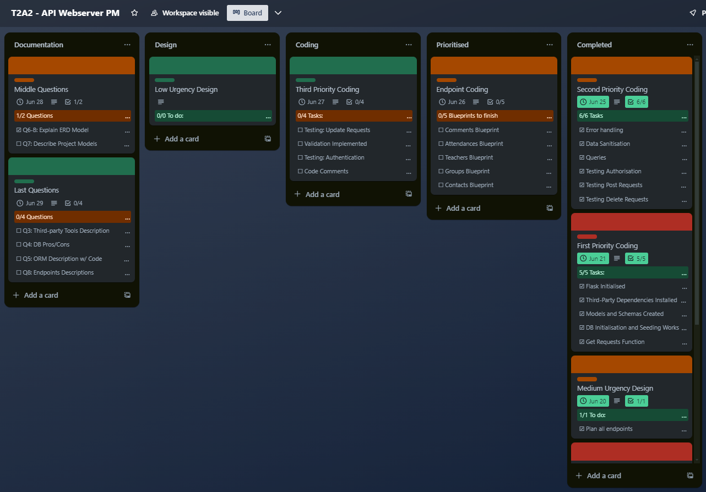

# T2A2-API-Webserver

This is a repository for my API Webserver Project.

## R1. Explain the problem that this app will solve, and explain how this app solves or addresses the problem /6

When running a service that involves looking after children, such as an after school care or class, it is vital that teachers and parents can contact eachother timely and easily. Children may become unwell or injured, or parents might simply want to stay informed about what activities their child is completing. However, a child's living situation or contact can change week-to-week or on certain days and it is difficult for businesses to have real-time knowledge on this information. For example, a child may have their parent pick them up on a Wednesday whilst a grandparent may pick them up on a Thursday.For these reasons, it is beneficial to have a centralised database that can ease teacher communication with parents and deliver up-to-date information to both sides.

Currently, there exist many popular apps and services for childcare businesses such as [OWNA](https://www.owna.com.au/features/childcare-communication-app.aspx) and [Xap](https://xap.net.au/childcare-parent-engagement-app-software/) which enable messaging and posts between staff and parents as well as contact information services. These apps are effective tools, however, aside from reduced functionality free versions, these products are also expensive. OWNA charges [$99 per month](https://www.owna.com.au/pricing.aspx) whilst Xap charges [$149 per month](https://xap.net.au/pricing/) to use their services. In addition, these services are delivered as complete applications, meaning they cannot be integrated into a separate website or service and also establishing product dependence from businesses.

Finally, data privacy is a serious concern for small businesses who are typically preoccupied with day-to-day operations. For this reason, the API collects and stores a minimal data about children and carers alike.

This API incorporates multiple measures to solve these issues. Functionally, the API allows businesses to securely store minimalistic but essential data about the children in their care and their contacts' information. A teacher user is able to access a child's designated carer so they can contact the appropriate person. The API also features a comment functionality that allows a teacher to post about children for records purposes and to communicate with parents. From the parent's side, parents receive a user account which allows them to add multiple contacts and designate who is the active carer on a particular day. Because the circumstances around contacting a carer change, a parent can also control whether an active contact should be overriden from receiving sensitive communications. Also, comments about a child can only be accessed from a user account meaning that temporary contacts cannot and do not have to engage with them.

This API provides a free alternative to expensive competitors and, being published as source code, allows businesses to integrate it into their own websites as well.

#### References

[Xplor Education expensive reviews](https://www.getapp.com/education-childcare-software/a/xplor/pricing/)

[OWNA features](https://www.owna.com.au/features/childcare-communication-app.aspx)

[Xap features](https://xap.net.au/childcare-parent-engagement-app-software/)

[OWNA pricing](https://www.owna.com.au/pricing.aspx)

[Xap pricing](https://xap.net.au/pricing/)

## R2. Describe the way tasks are allocated and tracked in your project /6

For this project, I am using an Agile workflow supplemented by a Trello board as a digital Kanban board (Brede Moe et al., 2014). To do this, I split the overall tasks into smaller tasks and categorised them based on their urgency and impact on other tasks. I entered this information onto my project Trello board, divided my available time and added deadlines to the tasks. I then maintained this Trello board and documented my progress with screenshots at the end of each day. At the beginning of the following day, I reviewed my progress from the prior day, made any neccessary adjustments to the checklist and deadlines and prioritised the next cluster of tasks.


An initial list of the tasks required to complete the project with an estimated urgency assigned.


A screenshot of the initialised Trello board.


The Trello board after one day of work.


The Trello board after two days of work.


The Trello board after three days of work.


The Trello board after four days of work. During this day I made some adjustments to the timelines.


The Trello board after five days of work. Again, I made some adjustments to the task timelines today after recognising that some of the checklist items were too broad. During this day I initialised the APIs baseline interactions which could be reused in other scopes easily.


The Trello board after six days of work. I added a new card to breakdown the task of finishing the API's endpoints.


The Trello board after seven days of work.


The Trello board after eight days of work.


The Trello board after nine days of work. During this day I troubleshooted some errors and progressed code comments but did not finish them. I also adjusted the project management timelines.

### References

Brede Moe, N., Dingsøyr, T., Dyba, T. (2014) 'Agile Project Management', in Ruhe, G., Wohlin, C. (eds.) _Software Project Management in a Changing World_. Berlin: Springer-Verlag, pp. 277-300.

## R3. List and explain the third-party services, packages and dependencies used in this app /6

* The description provided is DETAILED, and the description details ALL of the services, packages or dependencies that are used in the developed application.

## R4. Explain the benefits and drawbacks of this app’s underlying database system /6

* Identifies an appropriate database system and DESCRIBES benefits and/or drawbacks to a THOROUGH level of detail.

## R5. Explain the features, purpose and functionalities of the object-relational mapping system (ORM) used in this app /6

Object relational models (ORMs) are software packages that ease the conversion of code from one coding language into another language to interact with a relational database. In this application, SQLAlchemy is used to convert Python code to SQL for interaction with a PostgreSQL database. Using SQLAlchemy classes, the app contains models to create Pythonic objects that mirror entities stored in a connected relational database. This allows for object-oriented programming on the Pythonic side (Abba, 2022). Returned objects from the database are then interacted-with and sometimes altered, reformatted into SQL and sent for long-term storage in the connected database. Long-term storage is a particular advantage granted by ORMs and database storage as, otherwise, a Python application may not be able to preserve state between the app being started, closed and reopened (GeeksforGeeks, 2024).

The app uses SQLAlchemy's provided classes and methods to mirror the entities in a connected database. The following is an example of the "User" model built to interact with a "users" table in a connected relational database:

```Python
    class User(db.Model):
    __tablename__ = "users"
    id: Mapped[int] = mapped_column(autoincrement=True, primary_key=True)
    email: Mapped[str] = mapped_column(String(200))
    password: Mapped[Optional[str]] = mapped_column(String(200))
    first_name: Mapped[str] = mapped_column(String(200))
    is_admin: Mapped[bool] = mapped_column(Boolean(), server_default="false")
    is_teacher: Mapped[bool] = mapped_column(Boolean(), server_default="false")

    children: Mapped[List["Child"]] = relationship(
        back_populates="user", cascade="all, delete"
    )

    comments: Mapped[List["Comment"]] = relationship(
        back_populates="user", cascade="all, delete"
    )

    contacts: Mapped[List["Contact"]] = relationship(
        back_populates="user", cascade="all, delete"
    )

```

Each model in the app uses an SQLAlchemy instance, "db", that contains SQLAlchemy's methods for converting Pythonic data structures to SQL formatting. The User class uses these to describe each attribute stored in the "users" table and its data quality. In the above model, id is an integer that represents the primary key for "user" instances, email, password and first_name are all strings with a maximum length of 200 and is_admin and is_teacher are boolean values. As seen above, the model can also describe default values so that, if the model is used to record an instance in the database and no value is provided for the attribute, the default is used. The attributes "children", "comments" and "contacts" all represent seperate entities that are linked with the "users" table via foreign key. The ORM associates these foreign tables with the "User" model so that joined results can be returned when the Python application communicates with the database.

Another key feature of the ORM is its ability to craft complex SQL queries using simple Pythonic code.

```Python
        stmt = db.select(User).where(User.id == request.json["user_id"])
        user = db.session.scalar(stmt)
```

The stmt variable uses SQLAlchemy's methods (called from the db object) to generate a query statement. The statement generates a query requesting each of the values noted in the "User" and specifies the condition that the "id" value must equal the "user_id" value passed in a request body. The generated statement is this:

```SQL
    SELECT users.id, users.email, users.password, users.first_name, users.is_admin, users.is_teacher 
    FROM users 
    WHERE users.id = :id_1
```

This statement is then passed to the database using the db.session.scalar() method which returns any matched instances as a scalar object. These scalars can then be interacted with in the application.

Vitally, ORMs allow for simplified interaction between distinct coding languages such as Python and SQL. In this application, SQLAlchemy facilitates the conversion of Python data structures to SQL formatted code and objects. Without an ORM, the app would require its own unique code for mirroring the data structures in the connection database for any communication between the software. In addition, the ORMs robust structure and formatting provides some security measures as the SQL statement generation is abstracted away from the app's modules (GeeksforGeeks, 2024).

### References

Abba, I. V. (2022) _[What is an ORM – The Meaning of Object Relational Mapping Database Tools](https://www.freecodecamp.org/news/what-is-an-orm-the-meaning-of-object-relational-mapping-database-tools/)_, FreeCodeCamp website, accessed 29 June 2024.

GeeksforGeeks (2024) _[What is Object-Relational Mapping (ORM) in DBMS?](https://www.geeksforgeeks.org/what-is-object-relational-mapping-orm-in-dbms/)_, GeeksforGeeks website, accessed 29 June 2024.

## R6. Design an entity relationship diagram (ERD) for this app’s database, and explain how the relations between the diagrammed models will aid the database design /12

### This should focus on the database design BEFORE coding has begun, eg. during the project planning or design phase


The ERD Diagram for this API, created using Crow's Foot Notation (Abba, 2022). The entities recorded in the API's database are Users, Children, Comments, Teachers, Contacts, Groups and Attendances.


Updated diagram to include "comment_edited" and "date_edited" value.

Users are the central entity in the database as they grant parents, admin and teachers the ability to interact with the API. The User table's primary key is an ID and each instance also stores an email, password, first name and two booleans describing the type of account. Only the user's first name is stored in an effort to preserve privacy. The first name is required to identify a user's comment. When interacting with the API, users must first log in and receive a JWT which will then grant them access to different route functionality based on their admin and teacher status.

Before normalisation, Users would store child_ids, contact_ids and comment_ids as a single user is responsible for creating these values. These values are, instead, linked via foreign key.

Children are the next most prominent entity that is tracked and child tuples take their registering user's user_id as a foreign key. A user can register as many children as neccessary so it is a one-to-many relationship. Child tuples contain their first name and last name as well. Because children must be registered by their parents, teacher users cannot register children.

Without normalisation, a child instance would contain their listed contacts, however, because multiple children from the same family can share a contact, it makes sense to register contacts separately and link the two entities in a join table. Similarly, comments are about children so in a non-normalised table, this data would be stored with a child. Instead, tracking comments independently allows increased functionality and less duplication.

Comments are tuples that take a user_id and a child_id as foreign keys. The user_id links the user who is writing the comment with the message whilst the child_id links the comment to its subject, an individual child. Teachers and non-teachers can make comments but, parents can only read and write comments about children they have registered. Comments track the date they were created as well as an urgency rating. The urgency rating is chosen from "urgent", "positive" and "neutral". The urgency rating is included to allow for increased front end posibilities such as a user automatically receiving emails or notifications containing urgent comments.

Contacts are registered by parents and linked to the user that registered them. Contacts are entered with a name, a phone number, an optional email address and an emergency contact boolean. The emergency contact boolean allows emergency requests to skip a contact if they are not designated as appropriate for certain messages. For example, a child's grandparent may be their contact for pick-up information but a parent may want behavioural-based communications to be sent directly to themselves. In these circumstances, teachers or admin can access the appropriate contacts that have been designated by a user.

The Teachers table records a teacher's first name and their email. Groups are entities that describe the information of a class or lesson. Groups require one or more teacher_id values and contain the name of a group and the day it gathers. The day data being stored in groups allows for groups that share the same name meeting on different days of the week as well as describing altered groups based on the day such as a 3-year-old class being merged with a 4-year-old class only on Thursdays. Knowing their child's group allows a parent to access contact information for the teachers that are responsible for the group.

Attendances describe the days that a child attends child care, what group they are in and who their contact is for that day. Attendances take a child_id, group_id and contact_id as foreign keys. Attendances link all of this information so that a parent can specify different contacts for their children on different days. From the teacher's side, they can make API requests for the child's contact information on a given day.

Attendances are a join table created to enforce data normalisation. Attendance data could be noted in a child's tuple but it is not a complete piece of information without including the group that the child is a part of, something that would be recorded many times across children. For this reason, their attendance must be linked with a group_id that links the name of the group, its teacher and what day the group meets. All of this data, in combination with a designated contact for a particular day, uniquely describes which child attends what group on which day as well as who their primary contact is for that attendance.

### References

Abba, I (2022) _[Crow's Foot Notation – Relationship Symbols And How to Read Diagrams](https://www.freecodecamp.org/news/crows-foot-notation-relationship-symbols-and-how-to-read-diagrams/)_, FreeCodeCamp website, accessed 19 June 2024.

## R7. Explain the implemented models and their relationships, including how the relationships aid the database implementation

### This should focus on the database implementation AFTER coding has begun, eg. during the project development phase /6

* Provides a BRIEF description about the project’s models and their relationships, and includes BRIEF information about how the relationships of the models interact with other models, and includes information about the queries that could be used to access data using the models’ relationships and includes appropriate code examples supporting the descriptions.

User is the core model of this app and facilitates a user's interaction with the app. The user entity describes a unique account which has an email and password and carries an individual's privileges in the boolean values is_admin and is_teacher. These values are queried throughout the application to grant or bar access to instances that were not linked to the user's profile such as registered children or contacts. In addition, a user's id value is passed when registering a child, comment or contact instance as well for further privilege checks.

```Python
user_type = user_status(user_id)

if user_type == "Parent":
        stmt = db.select(Child).where(Child.user_id == user_id)
        registered_children = db.session.scalars(stmt).all()
        return ChildSchema(many=True).dump(registered_children)
```

In this code extract from the "get_children" function, the "user_status" function accepts the user's id value (as passed via their JWT) and returns a description of their user type and privileges. This is then referred to later to designate which SQL query is sent to the database. If the user is a "Parent", the database is queried for any child instances where the child's user_id value matches the requesting user's id. Any returned results are then returned to the user. Alternatively, when requesting a single child's data, if the child's user_id does not match the user's id, they are returned a 403 unauthorised HTTP error. Meanwhile, someone with a "True" is_admin value can access both. In other interactions, these values function differently. A parent can only post comments linked to their own registered children but a teacher account or admin can post comments linked to any child.

Child instances are the next most significant entity and provide foreign keys for comments and attendances. Comments take user_id and child_id as foreign keys to describe which child is being commented on and by who.

The user_id, child_id and comment models' relationship is leveraged when requesting a singular comment:

```Python
    stmt = db.select(Comment).where(Comment.child_id == id, Comment.comment_id == id2)
```

In this line, the database is queried for comments where the child_id value matches an id value submitted via the URI, essentially requesting a particular child's comments. The specific comment is then targeted via a URI input id2 which is compared to the comment's own primary key.

```Python
    comment_dict["user"]["id"] == user_id

```

Later in the same endpoint function, this line checks if the person who posted the returned comment is the user requesting the comment. If the user is not and admin, teacher or the user who posted the comment, the comment is not returned. These three models combine for specific and secure queries.

Users also register contacts who represent a child's point of contact for a particular day. Contacts take the a user_id foreign key which links a registered contact to a user. When a user attempts to interact with a contact, their id is compared to the user_id attribute of the contact.

The other models are the teacher and group entities which represent a teacher and their contact information and a class, it's name, teacher and meeting day respectively. When registering a group the admin user must provide a teacher id to link a teacher's name and their email to a group. This allows users to query to who their child's class' point of contact is.

All models contribute to the attendances entity which describes a child, which class they attend and who their contact is on that day. A join table, the attendance model links a child instance (including it's registering user), a group instance (including its respective teacher), and a contact (also linking its registering user). By querying an attendance, a teacher is able to find out who a child's contact is for the day, if they are an emergency contact, which group the child is attending and who the group's teacher is. At a different endpoint, a parent is able to query their registered child, see a list of their registered attendances and confirm who their contact is set as on each day.

## R8. Explain how to use this application’s API endpoints. Each endpoint should be explained, including the following data for each endpoint /6

Identifies ALL of the application’s API endpoints, including (for each identified endpoint) the HTTP verb, route path, and any required body or header data, and includes examples of what each identified endpoint will return on success AND failure of that endpoint operation

* HTTP verb
* Path or route
* Any required body or header data
* Response

### Users

GET User

* GET
* /Users OR /Users/<int:id>
* JWT_Token where is_admin == True
* Response: user_id, email, first_name, is_admin, is_teacher, 200/400, 401

CREATE User

* POST
* /Users
* Body: email, password, first_name
* Response: Success: user created, 200/400

UPDATE User

* PATCH
* /Users/<int:id>
* JWT_Token JWT_Token where is_admin == True or get_JWT_identity == user.id
* Body: email or password
* Response: {Success: user updated, changed_field: new_value}, 200, 400, 401

DELETE User

* DELETE
* /Users/<int:id>
* JWT_Token JWT_Token where is_admin == True
* Response: Success: user deleted, 200/400, 401

LOGIN User

* POST
* /Users
* Body: email, password
* Response: Access_token: token_id, 200/400

### Children

GET Child/Children

* GET
* /Children OR /Children/<int:id>
* JWT_Token where is_admin == True, is_teacher == False or children.user_id == get_JWT_identity
* Response: first_name, last_name, 200/400, 401

CREATE Child

* POST
* /Children
* JWT_Token where is_admin == True, is_teacher == False
* Body: first_name, last_name
* Response: {Success: child registered, first_name, last_name}, 200/400, 401

DELETE Child

* DELETE
* /Children/<int:id>
* JWT_Token where is_admin == True, or children.user_id == get_JWT_identity
* Response: {Success: child deleted}

UPDATE Child

* PUT
* /children/<int:id>
* JWT_Token where is_admin == True, or children.user_id == get_JWT_identity
* Response: {Success: data updated, field_updated: value}, 200/400, 401

### Comments

GET Comments

* GET
* /children/<int:id>/comments
* JWT_Token where is_admin == True, is_teacher == True or children.user_id == get_JWT_identity
* Response: date_created, urgency, children.first_name, children.last_name, message, 200/400, 401

CREATE Comment

* POST
* /children/<int:id>/comments
* JWT_Token where is_admin == True, is_teacher == True or children.user_id == get_JWT_identity
* Response: {Success: comment posted, date_created, urgency, children.first_name, children.last_name, message}, 200/400, 401

DELETE Comment

* DELETE
* /children/<int:id>/comments
* JWT_Token where is_admin == True, or children.user_id == get_JWT_identity, or comment.user_id == get_JWT_identity
* Response: {Success: comment deleted}, 200/400, 401

UPDATE Comment

* PATCH
* /children/<int:id>/comments
* JWT_Token where is_admin == True, or children.user_id == get_JWT_identity, or comment.user_id == get_JWT_identity
* Body: comment_id
* Response: {Success: comment updated, field_updated: new_value}, 200/400, 401

### Teachers

GET Teacher

* GET
* /teachers or teachers/<int:id>
* JWT_Token where is_admin == True, is_teacher == True
* Response: {teacher_id, first_name, email}, 200/400, 401

CREATE Teacher

* PUT
* /teachers
* JWT_Token where is_admin == True
* Body: {first_name, email}
* Response: {teacher_id, first_name, email}, 200/400, 401

* is_admin == True

UPDATE Teacher

* PATCH
* /teachers/<int:id>
* JWT_Token where is_admin == True
* Body: first_name or email
* Response: {Success: teacher updated, updated_field: new_value}, 200/400, 401

DELETE Teacher

* DELETE
* /teachers/<int:id>
* JWT_Token where is_admin == True
* Response: {Success: teacher deleted}, 200/400, 401

### Contacts

GET Contact

* GET
* /contacts/<int:id>
* JWT_Token where is_admin == True, is_teacher == True or contact.user_id == get_JWT_identity
* Response: contact_id, first_name, ph_number, emergency_cont, email, 200/400, 401

CREATE Contact

* POST
* /contacts
* JWT_Token where is_admin == True, is_teacher == False
* Body: first_name, ph_number, emergency_cont, email (optional)
* Response: {Success: contact registered, first_name, ph_number, emergency_cont, email}, 200/400, 401

UPDATE Contact

* PATCH
* /contacts/<int:id>
* JWT_Token where is_admin == True, or contact.user_id == get_JWT_identity
* Body: updated_field: new_value
* Response: {Success: contact updated, field_updated: new_value}, 200/400, 401

DELETE Contact

* DELETE
* /contacts/<int:id>
* JWT_Token where is_admin == True, or contact.user_id == get_JWT_identity
* Response: {Success: contact deleted}, 200/400, 401

### Groups

GET Group

* GET
* /groups or groups/<int:id>
* JWT_Token
* Response: {name, teacher_id, day, teacher.first_name, teacher.email}, 200/400, 401

CREATE Group

* PUT
* /groups
* JWT_Token where is_admin == True
* Body: {name, teacher_id, day}
* Response: {Success: group created, {name, teacher_id, day}}, 200/400, 401

UPDATE Group

* PATCH
* /groups/<int:id>
* JWT_Token where is_admin == True
* Body: {field_update: new_value}
* Response: {Success: group updated, updated_field: new_value}, 200/400, 401

DELETE Teacher

* DELETE
* /groups/<int:id>
* JWT_Token where is_admin == True
* Response: {Success: group deleted}, 200/400, 401

### Attendances

GET Attendance

* GET
* /children/attendances/<int:id>
* JWT_Token where is_admin == True, is_teacher == True or children.user_id == get_JWT_identity
* Response: {children.first_name, children.last_name}, {group.name, group.day}, {contact.first_name, contact.ph_number, contact.emergency_cont, contact.email}, 200/400, 401

CREATE Attendance

* POST
* /children/attendances
* JWT_Token where is_admin == True, is_teacher == False
* Body: child_id, group_id, contact_id
* Response: {Success: attendance registered, {children.first_name, children.last_name}, {group.name, group.day}, {contact.first_name, contact.ph_number, contact.emergency_cont, contact.email}}, 200/400, 401

UPDATE Attendance

* PATCH
* /children/attendances/<int:id>
* JWT_Token where is_admin == True, or child.user_id == get_JWT_identity
* Body: updated_field: new_value
* Response: {Success: contact updated, field_updated: new_value}, 200/400, 401

DELETE Attendance

* DELETE
* /children/attendances/<int:id>
* JWT_Token where is_admin == True, or child.user_id == get_JWT_identity
* Response: {Success: attendance deleted}, 200/400, 401
